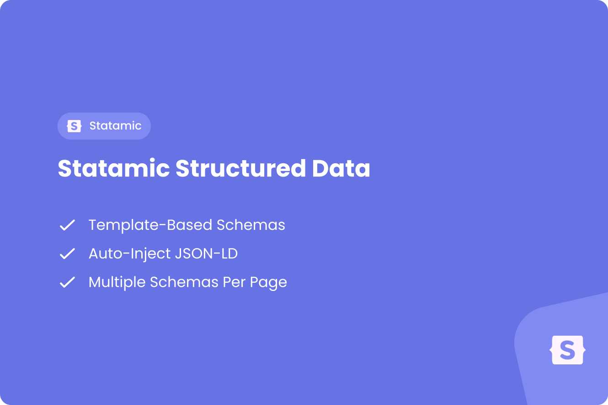

<a href="github.com/justbetter/statamic-structured-data" title="JustBetter">
    
</a>

# Statamic Structured Data

This Statamic addon provides a powerful and flexible way to add structured data (JSON-LD) to your Statamic website. It allows you to define structured data templates and automatically inject them into your pages, improving your site's SEO and making your content more understandable for search engines.

## Features

- 🔄 Dynamic JSON-LD generation based on entry, term, and Runway model data
- 📝 Template-based structured data configuration
- 📦 Built-in schema presets (WebSite, WebPage, Organization, Article, LocalBusiness)
- 🎯 Support for multiple schemas per page
- 🛠 Antlers template parsing support
- 🧩 Support for replicator-to-JSON-LD field mapping
- ✈️ Optional [Runway](https://statamic.com/addons/rad-pack/runway) resource support
- 💪 Flexible and extensible architecture

## Requirements

- PHP ^8.4 or ^8.5
- Laravel ^12.0
- Statamic ^6.0

## Installation

You can install this addon via Composer:

```bash
composer require justbetter/statamic-structured-data
```

After installing make sure to load the Structured Data tag in your head.

**Blade**:

``` blade
{!! Statamic::tag('structured-data:head')->fetch() !!}
```

**Antlers**

```html
{{ structured-data:head }}
```

## Configuration

Make sure to publish the config by running:

```bash
php artisan vendor:publish --tag=justbetter-structured-data
```

You can now find the config file at `config/justbetter/structured-data.php`.
After publishing the config, you can configure:

- which collections support structured data templates
- which taxonomies support structured data objects
- which Runway resource handles should use structured data templates
- whether presets are enabled
- which default presets are available
- custom preset paths

## Usage

### 1. Creating Structured Data Templates

Create templates in your Statamic control panel that define your structured data schemas. Each template can contain multiple schema definitions with:

- Special properties (@context, @type, @id)
- Custom fields with various data types (strings, numeric, arrays, objects)
- Dynamic values using Antlers templating syntax

### 2. Assigning Templates to Entries and Terms

In your entry or term's content, you can assign one or more structured data templates using the `structured_data_templates` field. The addon will automatically process these templates and generate the appropriate JSON-LD scripts.

### 3. Runway resources (optional)

Runway is soft-optional. When `statamic-rad-pack/runway` is installed, templates can target a Runway resource (`blueprint_type: runway` + `use_for_runway`). Those templates apply to **all** models of that resource at render time — there is no per-model template picker.

Enable resources in config:

```php
'runway' => [
    'product',
    'category',
],
```

For projects that use Runway frontend routing, `structured-data:head` resolves the current model via Runway URI lookup.

For Magento/Rapidez-style routes (or any custom routing), pass the current model explicitly:

**Blade**:

```blade
@isset($product)
    {!! Statamic::tag('structured-data:for')->param('item', $product)->param('resource', 'product')->fetch() !!}
@endisset
{!! Statamic::tag('structured-data:head')->fetch() !!}
```

The optional `resource` param forces the Runway handle when the storefront model class differs from the Runway model class.

Available variables for Runway templates include blueprint fields plus model attributes/appends.

### 4. Rendering Structured Data

Render the generated JSON-LD where you need it in your layout:

**Blade**:

```blade
{!! Statamic::tag('structured-data:head')->fetch() !!}
```

**Antlers**:

```antlers
{{ structured-data:head }}
```

## Example Schema

Here's an example of how you might structure a basic Organization schema:

```json
{
  "specialProps": {
    "context": "https://schema.org",
    "type": "Organization",
    "id": "https://example.com"
  },
  "fields": [
    {
      "key": "name",
      "type": "string",
      "value": "{{ company_name }}"
    },
    {
      "key": "url",
      "type": "string",
      "value": "{{ config:app:url }}"
    }
  ]
}
```

## Credits

- [Kevin Meijer](https://github.com/kevinmeijer97)
- [All Contributors](../../contributors)

## Contributing

Please see [CONTRIBUTING](.github/CONTRIBUTING.md) for details.

## Security Vulnerabilities

Please review [our security policy](../../security/policy) on how to report security vulnerabilities.

## License

The MIT License (MIT). Please see [License File](LICENSE) for more information.

<a href="https://justbetter.nl" title="JustBetter">
    
</a>
